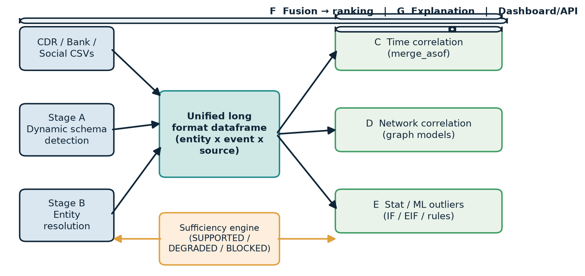
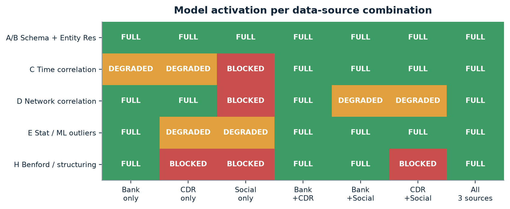
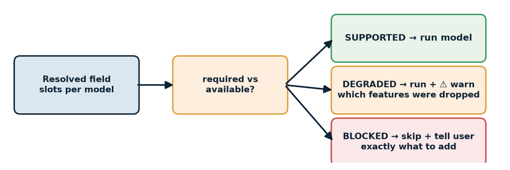
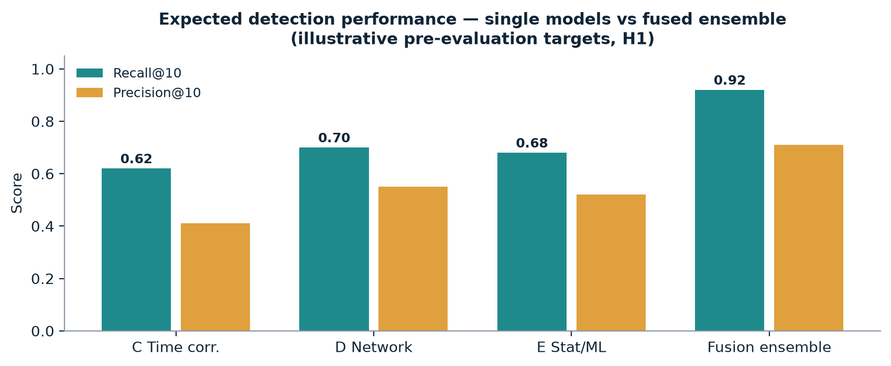

# Multi-Model Anomaly Detection Engine — Execution Plan & Research Base

**Project**: Multi-source financial intelligence — detect anomalous patterns across Call Detail Records (CDR), bank transactions, and social media activity, using a dataframe-centric pipeline with a *mixture* of specialized models.

**Goal of this doc**: (1) research grounding for every design decision, (2) a model testing matrix so each pipeline stage has 2-4 candidates evaluated before the final prototype, (3) a day-by-day execution plan parallelizable across the team.

**Modularity contract (this plan is implicitly that)**: the pipeline is **source-agnostic**. It accepts *any* combination of CDR / bank / social (or just one). Every stage auto-activates based on which fields were resolved; if the supplied data cannot support a stage/model, the system says so explicitly ("insufficient data: missing attribute X, required for model Y, suggested source Z") instead of failing silently or producing garbage.

---

## 1. System Architecture

```
sources/*.csv ──► [Stage A] Dynamic Schema Detection ──► [Stage B] Entity Resolution
                                                              │
                                                              ▼
                                                 [Unified long-format dataframe]
                                    entity_id | event_type | timestamp | source | amount | counterparty_id | location
                                                              │
              ┌───────────────────────────────────────────────┼────────────────────────────────┐
              ▼                                               ▼                                ▼
   [Stage C] Time-Correlation          [Stage D] Network Correlation      [Stage E] Statistical & ML Outliers
   models                              models                           models
              │                               │                                │
              └───────────────────────────────┴────────────────────────────────┘
                                                      │
                                   [Stage F] Score Fusion & Ranking
                                                      │
                                   [Stage G] Explanation Generator
                                                      │
                                              [Dashboard / API]
```

Design principle (backed by literature, §2): rule-based + statistical + graph + ML models each capture *different, complementary* signal dimensions of the same unified dataframe. No single model is trusted; the final prototype is an ensemble.

---

## 1B. Modular Adaptivity — Source Registry, Capability Matrix & Data-Sufficiency Engine

The pipeline never hardcodes "we have a bank file". Instead:

```
sources/*.csv ──► Registry: which source types are present?
                     │
                     ├─ Stage A resolves each file into canonical field slots
                     ├─ Capability matrix: which dimensions (amount/time/edges/text) are populated
                     ├─ Sufficiency engine: per-stage "required vs available" check → SUPPORTED / DEGRADED / BLOCKED (+ reason)
                     ▼
          Pipeline assembles ONLY the model set the data can support
```

### Source & field capability registry

Each source type declares which canonical field slots it can fill. This is the single source of truth for adaptivity.

| Canonical slot | Bank (txn) | CDR (call) | Social (post) |
|---|---|---|---|
| `timestamp` (time) | yes | yes | yes |
| `amount` (value) | **yes** | no | no |
| `counterparty_id` (edge) | yes (account) | yes (phone) | partial (tagged user / hashtag) |
| `event_type` (category) | txn | call | post |
| `location` (geo) | branch | tower | geo-tag |
| **Unique capabilities** | amount, direction, balance | duration, towers, strong edge signal | text sentiment, weak edges |

### Model activation matrix (combination-driven, not source-order-driven)

| Model (stage) | Bank only | CDR only | Social only | Bank+CDR | Bank+Social | CDR+Social | All three |
|---|---|---|---|---|---|---|---|
| C — Time correlation | internal (txn-txn) | internal (call-call) | weak/none | ✔ cross-source | ✔ cross-source | ✔ cross-source | **full pairwise** |
| D — Network correlation | ✔ (accounts) | ✔ (phones) | **blocked** (no trusted edge) | strong | weak | weak | strongest |
| E — Stat/ML outliers | ✔ (amount-heavy) | partial (frequency/duration only) | partial (text/freq only) | ✔ | ✔ | ✔ | ✔ |
| A/B — schema & entity resolution | ✔ | ✔ | ✔ | 👉 `counterparty_id` cross-resolve is the *only* thing that makes multi-source viable | | | |
| H — Benford / structuring rule | ✔ (needs `amount`) | **blocked** | **blocked** | ✔ | ✔ | blocked | ✔ |

`internal` = correlation across event types *within* the same source (still valuable); `cross-source` = the flagship signal; `weak / partial / blocked` = sufficiency verdicts.

### Data-sufficiency engine (user-facing)

For every model m, compute `availability = populated(required_fields(m)) / required_fields(m)` and resolve:

- **SUPPORTED** — all required canonical slots resolved. Model runs normally.
- **DEGRADED** — required slots present but thin (e.g., < N events per entity, no `amount` for the amount-features). Run, but surface a ⚠ warning listing which features were omitted and *why*.
- **BLOCKED** — a required slot missing entirely → model skipped, user gets a *specific* message:
  > "Network-correlation model skipped: no `counterparty`/edge dimension resolved. Add a CDR (phone) or bank (account) file, or a follow/hashtag column, to enable it."

This guarantees the "only bank statements" case still produces output (time + stat/ML models) while *telling the user why the graph and structuring views are absent* — no silent degradation, no false confidence.

### Failure-mode contract (what the demo will show)

| Input | Pipeline response |
|---|---|
| Bank only | Runs `A→B→(C internal, D weak, E, H blocked→warn)`, shows bank-specific insights + "add CDR to enable cross-source timing" |
| Bank + CDR | Adds full C cross-source correlation + D graph — the flagship demo scene |
| Bank + Social | Adds weak-edge D + geo correlation; warns edges are projected |
| Social only | Runs A→B→E(partial); blocks D & H with explicit reasons |
| Sparse file (<30 rows / entity) | A/B run; C/D/E → BLOCKED with "insufficient volume for statistical reliability (n=…)" |

---

## 1C. Pitch Content — Problem Statement → Expected Impact

*(This section is the markdown edition of the pitch deck: problem statement, proposed solution, key features, deliverables / proposed outcome, prototype, and expected impact — with tables and graphs. Charts live in `assets/charts/` and are generated by `assets/make_charts.py`.)*

### 1C.1 Problem Statement

**A $2 trillion blind spot.** The UN estimates 2–5% of global GDP — roughly **$0.8–2.0 trillion** — is laundered every year. Legacy rule-based monitoring (fixed thresholds) produces heavy false-positive queues, so analysts drown in alert volume while real risk slips through. Criminals sculpt behavior to stay under the radar:

- **Structuring / smurfing** — splitting large sums just under reporting thresholds.
- **Dormant-to-active flips** — temporarily dormant accounts suddenly lighting up.
- **Cross-channel co-location** — a call or a social post minutes before a transfer, invisible to any single-source monitor.

**What existing systems miss** (the three failure modes we engineer against):

| Failure mode | Concrete example |
|---|---|
| Cross-source blindness | A call recorded 19 minutes before a transfer is invisible to a bank-only monitor — the link between sources is the crime signal |
| Schema fragility | `txn_date` vs `posted_at` vs `call_time` — a hardcoded parser dies on the first new export |
| Coverage dishonesty | Tools silently run with missing attributes instead of telling the user what is absent (no "insufficient data" story) |

**The data reality** (column-name chaos) drives the first two failure modes:

| Attribute | Bank file A | Bank file B | CDR file | Social export |
|---|---|---|---|---|
| timestamp | `txn_date` | `posted_at` | `call_time` | `created_utc` |
| counterparty | `account_id` | `beneficiary` | `msisdn (caller)` | mentions / hashtags |
| value | `debit/credit` | `amount` | — none | — none |
| location | `branch_code` | — | `tower_id` | `geo_tag` |

The consequence: **no fixed parser can work**. The pipeline must detect schema at runtime and tell the user exactly when a model cannot be supported.

### 1C.2 Proposed Solution

One **source-agnostic, modular pipeline**: every model captures a different signal dimension of a single unified dataframe, and only the models the data can actually support are activated.



**The five-step pipeline:**

1. **Dynamic schema detection** — fuzzy header matching (rapidfuzz, threshold ~80) + content-probe fallback ("parses as date 90%+ → timestamp; phone regex → phone; currency precision → amount"). Source classification (bank / CDR / social) falls out as a byproduct of which canonical fields resolved.
2. **Entity resolution** — blocking → Jaro-Winkler → weighted Fellegi–Sunter scores to tie one person across bank, call, and social records with no shared ID.
3. **Unified long-format dataframe** — every model reads the same table:

| entity_id | event_type | timestamp | source | amount | counterparty_id | location |
|---|---|---|---|---|---|---|
| E014 | call | 09:12 | cdr | — | E027 | tower_112 |
| E014 | transaction | 09:24 | bank | 48,000 | 027 | — |
| E047 | post | 09:27 | social | — | — | geo_tag |

4. **Three analysis stages in parallel** — Time correlation (`merge_asof`), Network correlation (graph models), Statistical & ML outliers (Isolation Forest family + rules).
5. **Fusion → ranking → explanation → dashboard** — normalized per-model scores combined, with a template-filled statement telling the user *which models fired and why*.

Modular adaptivity (registry + sufficiency engine) is covered in detail in §1B; the pitch framing is in §1C.3.

### 1C.3 Key Features

| # | Feature | What it does |
|---|---|---|
| 1 | **Dynamic schema detection** | Header fuzzy-match + content inference; handles renamed/unlabeled columns and classifies source type |
| 2 | **Entity resolution** | Blocking + Jaro-Winkler + Fellegi–Sunter weighting; resolves one person across sources without a shared ID |
| 3 | **Multi-model ensemble** | Time (merge_asof) · Network (OddBall / centrality-shift) · Stat-ML (IF / rules) fused into a ranking |
| 4 | **Data-sufficiency engine** | Per-stage **SUPPORTED / DEGRADED / BLOCKED** verdicts with human-readable reasons; never silent failure |
| 5 | **Explainable insights** | Template narration per flagged entity: which models fired, the evidence, the combined score |
| 6 | **One-command evaluation** | Answer-key harness: recall@k, precision@k, per-anomaly-type ablation — every claim verified |

**Model activation depends on the source combination** — the matrix that makes the system truly modular:



- **FULL** — all required fields resolved → model runs.
- **DEGRADED** — runs on a feature subset, user warned which features were dropped.
- **BLOCKED** — skipped with a specific, actionable reason.

Example user-facing messages:

> "Network-correlation model skipped: no counterparty/edge dimension resolved. Add a bank (account) or call (phone) file to enable it."

> "Stat/ML DEGRADED: averaged <30 events/entity; some features dropped for reliability."



**The model zoo** (each stage tested with several candidates; final prototype keeps the best 1–2):

| Stage | Candidates to test | Unique signal captured |
|---|---|---|
| A — schema | header-only · content-only · hybrid | hybrid rescues renamed & unlabeled columns |
| B — entity resolution | exact · blocking+Jaro-Winkler · weighted fuzzy | weights fuse multiple match evidence |
| C — time correlation | merge_asof · sliding-window z-score · lag cross-corr | cross-source timing — the flagship CDR+bank signal |
| D — network | OddBall · centrality-shift · Louvain · subgraph mining · [stretch GNN] | role shifts, cluster re-wiring, AML flow shapes |
| E — stat/ML | IsolationForest · Extended IF · LOF · Benford · change-point | feature-space outliers & behavioral regime flips |
| F — fusion ranking | equal-weights · Borda rank aggregation · meta-learner (RF/XGB) | robust ranking when sources disagree |

### 1C.4 Deliverables / Proposed Outcome

**What we ship:**

<div align="center">

| # | Deliverable |
|---|---|
| 1 | Auto-adaptive ingestion + schema detection |
| 2 | Capability registry + sufficiency engine |
| 3 | Three analysis model families on one shared dataframe |
| 4 | Fusion ranking + explanation generator |
| 5 | FastAPI + live ranked-insights dashboard |
| 6 | Synthetic data generator + hidden answer key |
| 7 | One-command evaluation harness |

</div>

**Outcome targets** (illustrative; the harness in §4.1 is how we prove them):

| Measure | Target | How it is proven |
|---|---|---|
| Recall@10 on predefined storylines | ≥ 0.95 | answer-key harness |
| Recall@10 on surprise anomalies | ≥ 0.8 | write-only surprise key |
| Precision@10 (false-alert control) | ≥ 0.6 | harness + analyst review |
| Fusion vs. best single model | ≥ +0.15 recall@10 (H1) | ablation / leave-one-out |
| Schema adoption on renamed file | 100% correct | Stage A stress-test |
| Sufficiency message in insufficient-data demo | shows the exact blocked model + reason | scenario matrix |

The **two-tier data design** is what makes A/B proof credible: predefined storylines (scripted ground truth, used to verify each model) + a **randomized surprise injector** that writes only to a secret answer key — so any entity the system flags from that set is a genuine generalization, not a lookup table.

### 1C.5 Prototype

End-to-end flow demoed on synthetic data (mocked, then real code on day 1):

| Pane | Content shown |
|---|---|
| **Pipeline run summary** | Sources detected: BANK + CDR (cross-source link available) · sufficiency verdict per model (C FULL, D FULL, E FULL, H DEGRADED) · unified table stats (12,480 events · 214 entities · 31 linked pairs) |
| **Ranked insights** | 1 · E014 · 0.93 — call at 09:12 then transfer at 09:24; 2 · E027 · 0.86 — new dense node, 9 contact points in 24h; 3 · E052 · 0.78 — dormant 41d, then large deposits |
| **Explanation panel** | "Time model: transfer landed 19 min after a call to the same account. Network model: new strong edge (48k). Fusion score 0.82." |

**Demo walks (4 minutes, for the judges):**

1. **W1 · Bank-only** → how the sufficiency engine tells the user what to add and what stays active.
2. **W2 · Bank + CDR** → the co-location insight appears live; the system adapts.
3. **W3 · surprise file** → the detector finds fully-anonymized anomalies it was never shown.
4. **W4 · renamed columns** → schema detects every field and never breaks.

**MVP scope cut language** — the demo is engineered for days-out readiness: real pipeline + heat of three signal families + ranking + the "insufficient data" conviction. Post-eval (nice-to-haves, not on critical path): deep-learning graph models (GNN/TGN), map view, fine-threshold tuning.

### 1C.6 Expected Impact



*Illustrative pre-evaluation targets to validate **H1** (§3), the claim that the fused ensemble beats every single model family on recall@10.*

- **Behavior change, not just alert volume** — fusion lifts recall *and* precision together: fewer false queues, cheaper to operate, higher analyst trust.
- **Adaptivity = trustworthy** — the system is honest about insufficient data, so when it fires, the user can act with confidence.
- **Generalizes beyond banking** — the identical pipeline reads e-commerce, ride-hailing, or mobile-money logs wherever transaction + contact data overlaps.

*(Execution roadmap with parallelization is in §5; the chart version: `assets/charts/roadmap.png`.)*

---

## 2. Research Foundation

### 2.1 Synthetic Data Generation — the precedent that validates your two-tier design

| Paper | Key idea | What we take |
|---|---|---|
| **Altman et al. (IBM), "Realistic Synthetic Financial Transactions for AML Models", NeurIPS 2023 Datasets & Benchmarks** — arXiv:2306.16424 | Agent-based generator calibrated to real transaction distributions; injects labeled laundering patterns (smurfing, fan-in/fan-out, cyclical layering) into a background of normal behavior. Ground truth labels are **complete** — a key advantage over real data | Calibrate our "normal" generator so anomalies are actually rare & surprising; log complete ground truth (answer key). Their evaluation approach (comparing models on labeled synthetic data) is our evaluation approach |
| **Jensen et al. (Utrecht + Spar Nord), "A synthetic data set to benchmark AML methods", Scientific Data 2023** — doi:10.1038/s41597-023-02569-2 | SynthAML: 16M+ transactions, 20K alerts, generated with SDV Gaussian copulas from a real bank. Shows synthetic performance **transfers to the real world** | Justifies demoing on synthetic data; use their benchmark framing (precision, recall, class imbalance) |
| **Oztas et al., "SAML-D", IEEE ICEBE 2023** — doi:10.1109/ICEBE59045.2023.00028 | Typology-based AML dataset: 17 suspicious typologies vs 11 normal | Direct model for our *storylines*: define typologies as executable generators, not ad-hoc events |
| **Egressy et al., "AMLworld"** (EmergentMind 2306.16424 related) | Extends IBM generator with per-agent bank accounts and background population | Use to enrich our base population realism |

**Our adaptation**: IBM-style agent-based "normal" behavior + SAML-D-style typology storylines (predefined, verified) + **randomized surprise injector** (write-only answer key). This follows the NeurIPS benchmark methodology: complete labels + realistic background.

### 2.2 Schema Detection & Entity Resolution — dynamic extraction stage

| Source | Key idea | What we take |
|---|---|---|
| **Fellegi & Sunter (1969), "A theory for record linkage", JASA** | Probabilistic record linkage: weight per-field match evidence, threshold to decide match/non-match | Two-stage confidence: header fuzzy-match first, content inference as fallback |
| **Christen, "Data Matching", Springer 2012** (canonical textbook) | The ER workflow: cleaning → blocking/indexing → comparing → classifying → evaluating, with feedback | Standard workflow for our entity-resolution stage; blocking to keep it fast |
| **Papadakis et al., "Blocking and Filtering Techniques for ER: A Survey", ACM Computing Surveys 2020** | Blocking keys (e.g., first letters, soundex, locality) reduce pair comparisons by orders of magnitude | Cheap blocking on phone prefix + name tokens before any fuzzy comparison |
| **Biswas, "A Fuzzy Approach to Record Linkages", arXiv:2402.03464** | Fuzzy string matching + weighted linkage scores for records across disparate sources (industry: Verizon) | Our counterparty-ID resolution across bank/CDR/social uses the same fuzzy weighted score idea |
| **RapidFuzz / Levenshtein / Jaro-Winkler** (engineering standard, rapidfuzz `process.extractOne`) | Token-set-ratio and Jaro-Winkler dominate name/column matching in practice | `FIELD_ALIASES` + `process.extractOne` with a score threshold (~80) — already drafted |

**Takeaway**: the dynamic schema detector is a *column-level record linkage* problem — apply Fellegi-Sunter logic (evidence from multiple matches, content probes) rather than a single hardcoded mapping. Source-type classification (CDR vs bank vs social) falls out as a byproduct of which canonical fields matched.

### 2.3 Time-Correlation Models

| Source | Key idea | What we take | 
|---|---|---|
| **pandas `merge_asof`** (pandas docs) | Nearest-key join on time within tolerance — the standard tool for cross-source temporal correlation | Pairwise joins (call↔txn, post↔txn, call↔post) with 15–30 min tolerance |
| **Liu et al., "Anomaly and change point detection for time series with concept drift", WWW Journal 2023** | Distinguish *change points* (distribution shift) from *anomalies* (isolated outliers); uses second-derivative features + DTW for multivariate | Guide for the dormant→active-flip signal: it's a change point, not an anomaly — treat it with its own detector (§3, Stage E) |
| **Pereira et al., "Processing evolving social networks for change detection based on centrality measures"** | Track temporal evolution of per-node metrics, flag abrupt shifts via change-point scoring | Baseline alternative to merge_asof: per-entity sliding windows of cross-source co-occurrence, z-score the shift |

**Candidate models** (to test): (1) `merge_asof` pairwise correlation, (2) sliding-window co-occurrence counts + z-score, (3) lagged cross-correlation per entity pair. Metrics: recall of surprise "colocation" type, precision.

### 2.4 Network / Graph Correlation Models

| Source | Key idea | What we take |
|---|---|---|
| **Vilella et al., "WeirdNodes: centrality-based anomaly detection on temporal networks for the anti-financial crime domain", Applied Network Science 2025** | Track per-node centrality rankings over time; flag **abrupt role shifts** (node suddenly becoming hub, or disappearing from rankings) — evaluated on 80M+ wire transfers, validated on labeled perturbations | Directly maps to our "sudden new edges" and "dormant-to-active" signals. Use their perturbation-validation methodology for our surprise set |
| **Bellei et al., "The Shape of Money Laundering: Subgraph Representation Learning... Elliptic2", arXiv:2404.19109** | AML is inherently a *subgraph* problem; suspicious "shapes" (layering chains, fan-in/fan-out) are subgraph patterns in a background graph | Frame our graph model as: extract suspicious subgraph patterns (stars, chains, near-complete bipartite) around each entity, score by pattern deviation |
| **Tzougrakis et al., "AntiBenford Subgraphs", arXiv:2205.13426** | Combine Benford's law (first-digit distribution) with dense subgraph discovery on transaction networks; catches **structuring/smurf-like** flow patterns | Structuring storyline → first-digit histogram deviation per entity + dense subgraph detection |
| **Akoglu et al., "OddBall: Spotting anomalies in weighted graphs", PAKDD 2010** | Power-law-fitted neighborhood features (degree vs. total weight vs. neighbors' degrees); nodes far off the fitted line are anomalies | Lightweight, no training — ideal baseline graph scorer for hackathon |
| **Kim et al., "Temporal Graph Networks for Graph Anomaly Detection in Financial Networks", arXiv:2404.00060 (AAAI 2024 WS)** | TGN beats static GNN and hypergraph baselines on DGraph financial dataset (AUC) | Stretch goal if time permits: TGN-style temporal edge embedding on call+txn graph |
| **Motie & Raahemi, "Financial fraud detection using graph neural networks: a systematic review", ESWA 2024** | Survey of GNN fraud detection | Reference map if we escalate to GNNs |
| **Deprez et al., "Network analytics for AML — a systematic literature review and experimental evaluation", arXiv:2405.19383** | Comparative evaluation of network-analytics AML methods | Use as tie-breaker for graph model selection |

**Candidate models** (to test): (1) OddBall-style density/feature anomalies, (2) WeirdNodes-style centrality rank-shift scoring, (3) Louvain community + "community membership change" score, (4) subgraph pattern miner (fan-in/fan-out/chain detectors), (5) [stretch] TGN. Metrics: recall of "new dense connection" and surprise "colocation" (graph side).

### 2.5 Statistical & ML Outlier Models

| Source | Key idea | What we take |
|---|---|---|
| **Ajagbe et al., "Comparative analysis of ML algorithms for money laundering detection", Discover AI 2025** | Benchmarked XGBoost, KNN, RF, Isolation Forest, SVM on IBM AML data; XGBoost strongest, **recommends combining Benford + ML** | Justifies testing gradient boosting as a *meta* scorer; adopt Benford as a feature/rule |
| **Liu et al., "Isolation Forest", ICDM 2008** | Anomalies are few and different → isolate with random splits; path length = anomaly score | Base outlier model on per-entity feature vectors |
| **Hariri et al., "Extended Isolation Forest" (EIF), ICDM 2019** | Fixes IF's axis-aligned bias with random slopes — better for multivariate correlations | Strong candidate to test against vanilla IF |
| **Breunig et al., "LOF", SIGMOD 2000** | Density-based outliers | Candidate for feature-space outliers |
| **Bayesian change point detection / ruptures library (Truong et al. 2020)** | Detects regime shifts in sequences | For dormant→active flip and "silence after txn" as *behavioral* (not point) anomalies |
| **LSTM autoencoder** (survey: "Time series anomaly detection with Isolation Forest and LSTM", MLJourney 2025; LSTM-AE for transaction sequences) | Reconstruction error on per-entity event sequences flags deviations from learned normal pattern | Stretch model for sequential structure (structured deposits sequences) |

**Feature vector per entity** (the thing every Stage E model consumes — engineered once, shared):
- counts: calls, txns, posts per window
- txn total / mean / std / max, structuring proximity (count of txns within X% below threshold)
- unique counterparties (fan-out), unique senders (fan-in)
- hour-of-day entropy, day-of-week entropy (rhythm regularity)
- night-activity ratio, weekend ratio
- first-digit Benford deviation (chi-square)
- temporal: max gap between events, min gap, variance of inter-event intervals
- cross-source co-occurrence count (from Stage C output)

**Candidate models** (to test): (1) Isolation Forest, (2) Extended IF, (3) LOF, (4) LSTM-autoencoder (stretch), (5) rule set from literature (Benford chi-square + threshold proximity + fan-in/out). Metrics: recall@k on surprise set, precision.

### 2.6 Fusion, Ranking & Explanation

| Source | Key idea | What we take |
|---|---|---|
| **Weighted score fusion** (standard ensemble practice; cf. Ajagbe hybrid recommendation) | Normalize each model to 0–1, weighted sum | Start with equal weights — defensible baseline |
| **Rank aggregation (e.g., Borda count / RRA)** | Combine *rankings* instead of scores — robust to scale differences | Test against weighted-sum |
| **Eddin et al., "AML alert optimization using ML with graphs", arXiv:2112.07508** | Machine-learned prioritization of AML alerts using graph features + RF/XGBoost | If we want to get fancy: meta-learner over per-model scores + entity features |
| **XAI practice (cf. arXiv:2509.09127 AML pipelines w/ XAI)** | Explainability modules improve credibility | Explanation strings: template-driven with model names + evidence + combined score |

---

## 3. Model Testing Matrix (the "try different models per stage" plan)

Every stage below lists candidates. **Rule**: candidates are implemented behind one interface (`Stage` class with `fit(df) -> scores`), run against the same labeled answer key, and compared with a single eval script. The final prototype keeps the best 1–2 per stage based on §4 metrics — *mixture of models, each capturing a unique dataset dimension*.

| Stage | Candidate models | Unique signal each captures | Likely winner |
|---|---|---|---|
| **A. Schema detection** | (1) RapidFuzz header-only; (2) content-probe fallback only; (3) hybrid (header + content + source classification) | (3) catches renamed headers *and* unlabeled columns | Hybrid |
| **B. Entity resolution** | (1) exact ID/phone join; (2) blocking + Jaro-Winkler fuzzy; (3) fuzzy + weighted multi-field (Fellegi–Sunter style) | (3) resolves same person across sources w/o shared ID | Weighted fuzzy |
| **C. Time correlation** | (1) `merge_asof` pairwise; (2) sliding-window co-occurrence + z-score; (3) per-pair lagged cross-correlation | (1) fast, (2) robust to offsets, (3) detects regular (not single) correlation | merge_asof + z-score combo |
| **D. Network** | (1) OddBall features; (2) WeirdNodes centrality-shift; (3) Louvain + membership change; (4) subgraph pattern miner; (5) [stretch] TGN | (2) role shifts, (3) cluster evolution, (4) AML structural shapes | WeirdNodes-style + subgraph miner |
| **E. Stat/ML outliers** | (1) Isolation Forest; (2) Extended IF; (3) LOF; (4) Benford chi-square rule; (5) Bayesian change point (ruptures); (6) [stretch] LSTM-AE | (1-3) feature-space outliers, (4) digit-distribution anomalies, (5) behavioral regime flips | IF + EIF + change point |
| **F. Fusion** | (1) equal-weight sum; (2) rank aggregation (Borda); (3) RF/XGBoost meta-learner | (3) learns which model matters when (needs label leakage control) | Borda or meta-learner |
| **G. Explanation** | (1) template strings; (2) template + LLM paraphrase (stretch) | — | Template |

### Experiment hypotheses (to be validated before the demo)
- **H1**: No single Stage C/D/E model exceeds ~0.7 recall@10 alone; the fused ensemble exceeds 0.9. (Justifies the mixture-of-models pitch.)
- **H2**: The content-probe fallback in Stage A rescues at least one deliberately-renamed-column file that pure header matching misses.
- **H3**: The surprise-injection set is caught mostly by Stage E (+ C), while predefined storylines are caught by D/E/C in different proportions — proving model specialization.
- **H4**: Extended IF beats vanilla IF on feature vectors with correlated features.

---

## 4. Evaluation Framework

### 4.1 Data artifacts
- `data/sources/` — exported CSVs with *varied, non-uniform* column names (some renamed deliberately to stress Stage A; one file with only headers, one with unlabeled data).
- `data/answer_key.json` — **write-only** for surprise entries (generated by injector, never read during development except by the eval script at test time). Predefined storylines have their own documented ground truth.
- Ground truth is *per entity* (entity flagged or not), with anomaly-type labels for ablation analysis.

### 4.2 Metrics
- `recall@k`, `precision@k` for k = 5, 10 (ranked dashboard view is the demo artifact)
- F1 / Average Precision over full score
- Per-model and per-anomaly-type confusion (colocation vs. dormant-flip vs. structuring vs. silence-after-txn)
- Model agreement analysis (which entities only 1 model caught — the fusion value story)
- Ablation: leave-one-model-out score change

### 4.3 Harness
`eval.py --config experiments/exp1.yaml` — loads answer key, runs chosen model mix, prints metrics table + stores JSON. One command per experiment; results land in `results/`.

---

## 5. Execution Timeline (28h budget, parallel after hour 2)

| Hours | Task | Owner(s) | Deliverable |
|---|---|---|---|
| 0–2 | Schema freeze: unified dataframe spec + FIELD_ALIASES + storyline scripts | All | `SCHEMA.md`, alias dict |
| 2–8 | Synthetic generator: base population + 6 predefined storylines + surprise injector + answer key | A (data) | `data_generator/` working |
| 8–13 | Stage A dynamic extraction (header + content fallback) | B | `schema_detect/` + stress-test files |
| 8–13 | Stage B entity resolution | C | `entity_resolve/` |
| 13–16 | Unified pipeline (normalize → resolve → long table) + **capability registry + sufficiency engine** (SUPPORTED/DEGRADED/BLOCKED messages per combo) + ETL smoke test | A/B/C together | `pipeline/` E2E + `sufficiency/` |
| 16–24 | **Parallel tracks** (locked schema): | | |
| | Stage C time correlation — merge_asof + z-score | B | `models/time_corr.py` |
| | Stage D network — OddBall + centrality-shift + subgraph miner | C | `models/network.py` |
| | Stage E stat/ML — IF/EIF/LOF/Benford/change point | D | `models/statml.py` |
| | Dashboard + API scaffold on mocked scores | E | `app/` |
| 24–28 | Stage F fusion + Stage G explanations + wire real scores | D + E | E2E API→dashboard |
| 28–30 | Validation vs answer key; tune thresholds (NOT models/features) | All | metrics report |
| 30+ | Polish: dashboards, demo script, fallback storylines | All | demo |

**Parallelization guardrail**: nobody touches `SCHEMA.md` or the unified dataframe columns after hour 2; all model owners work against the same fixture CSV.

---

## 6. Tech Stack

- Python 3.11+, pandas (merge_asof), numpy, scipy
- rapidfuzz (schema/ER), networkx (graph), igraph optional
- scikit-learn: IsolationForest, ExtendedIsolationForest (via `eif` or `sklearn-ext`), LOF, RF/XGBoost meta
- ruptures (change point), [stretch] torch + PyG or torch-geometric-lite for TGN
- FastAPI + Streamlit/React dashboard
- `hydra` or plain YAML configs + `pytest` for pipeline unit tests
- **Adaptivity core**: `capability_registry.yaml` (source→field slots), `sufficiency.py` (SUPPORTED/DEGRADED/BLOCKED), model `activate(features)` hooks — every stage implements `required_features()` so the registry is self-describing

## 7. Risks & Mitigations

| Risk | Mitigation |
|---|---|
| Surprise injector leaks into dev (looks rigged) | Write-only answer key file; injector seeded separately from dev runs |
| Models overfit storylines (H1 fails, fusion adds nothing) | H1 test is the gate — if fusion < best single model, present single-model + explain |
| Stage A breaks on truly weird files | Keep demo files within alias dictionary coverage; show graceful "unmapped column" warnings |
| GNN/LSTM scope creep | Marked stretch; fixed-timebox, fall back to OddBall/TGN-lite |
| No public real data | Synthetic with published precedent (IBM NeurIPS 2023); cite it in the pitch |

## 8. Key References (for the pitch deck)

1. Altman et al., *Realistic Synthetic Financial Transactions for AML Models*, NeurIPS 2023 D&B — arXiv:2306.16424
2. Jensen et al., *A synthetic data set to benchmark AML methods*, Scientific Data 10:661 (2023) — doi:10.1038/s41597-023-02569-2
3. Oztas et al., *SAML-D*, IEEE ICEBE 2023 — doi:10.1109/ICEBE59045.2023.00028
4. Vilella et al., *WeirdNodes: centrality-based anomaly detection on temporal networks for AFC*, Applied Network Science 10 (2025) — doi:10.1007/s41109-025-00702-1
5. Bellei et al., *The Shape of Money Laundering: Subgraph Representation Learning with Elliptic2*, arXiv:2404.19109
6. Tzougrakis et al., *AntiBenford Subgraphs*, arXiv:2205.13426
7. Akoglu et al., *OddBall*, PAKDD 2010
8. Kim et al., *TGN for Graph Anomaly Detection in Financial Networks*, AAAI 2024 WS — arXiv:2404.00060
9. Ajagbe et al., *Comparative analysis of ML algorithms for money laundering detection*, Discover AI 5:144 (2025)
10. Hariri et al., *Extended Isolation Forest*, ICDM 2019
11. Liu et al., *Isolation Forest*, ICDM 2008
12. Papadakis et al., *Blocking and Filtering for ER: A Survey*, ACM CSUR 53(2) (2020)
13. Fellegi & Sunter, *A Theory for Record Linkage*, JASA 64(328) (1969)
14. Deprez et al., *Network Analytics for AML: SLR and experimental evaluation*, arXiv:2405.19383
